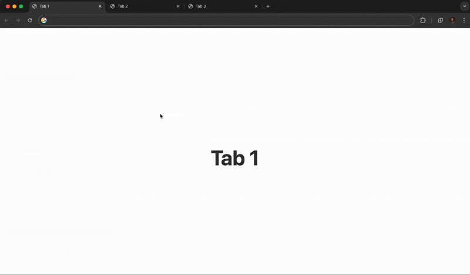

# Tab History Navigator

## Project Overview

The **Tab History Navigator** is a Chrome extension designed to enhance the browsing experience by allowing users to navigate through their tab history efficiently. This extension keeps track of the tabs a user has opened, enabling them to go back and forth between tabs using customizable keyboard shortcuts. It aims to provide a seamless way to manage and access previously visited tabs, improving productivity and user experience.

## Demo

*Navigate through your tab history chronologically using Ctrl+Shift+← and Ctrl+Shift+→ shortcuts*

## Features

- **Tab History Management**: Automatically tracks the tabs opened during a browsing session.
- **Keyboard Shortcuts**: Navigate through tab history using customizable keyboard shortcuts.
- **History Limit**: Configurable limit on the number of tabs stored in history to prevent memory issues.
- **Cross-Window Navigation**: Allows users to navigate through tabs across different windows.
- **Incognito Mode Support**: Optionally supports tab history in incognito mode with user permission.
- **Sync Across Devices**: Syncs tab history across devices using Chrome's storage capabilities.
- **Privacy-First Analytics**: Optional anonymous usage analytics to improve the extension (see [Analytics Setup](ANALYTICS_SETUP.md))

## Installation

### Easy Installation (Recommended)
1. Go to the [Releases](../../releases) page
2. Download the latest `.zip` file
3. Unzip the downloaded file to a folder on your computer
4. Open Chrome and navigate to `chrome://extensions/`
5. Enable "Developer mode" in the top right corner
6. Click "Load unpacked" and select the unzipped folder

### Alternative: Manual Installation from Source
1. Download or clone this repository
2. Open Chrome and navigate to `chrome://extensions/`
3. Enable "Developer mode" in the top right corner
4. Click "Load unpacked" and select the project directory

## Usage

Once installed, the extension will automatically start tracking your tab history. Use the following keyboard shortcuts to navigate:

- **Go Back**: Ctrl+Shift+Left
- **Go Forward**: Ctrl+Shift+Right

## Updates

To update the extension:
1. Download the latest version from [Releases](../../releases)
2. Unzip the new version to replace your existing folder
3. Go to `chrome://extensions/` and click the refresh icon on Tab Navigator

Alternatively, you can enable "Auto-reload" in Developer mode to automatically detect changes.

## Troubleshooting

**Extension not working after installation?**
- Make sure "Developer mode" is enabled in `chrome://extensions/`
- Try refreshing the extension by clicking the refresh icon
- Check that you selected the correct folder (should contain `manifest.json`)

**Keyboard shortcuts not working?**
- Check for conflicting shortcuts in `chrome://extensions/shortcuts/`
- Try customizing the shortcuts if needed

## Future Improvements

For suggestions on future improvements and features, please refer to the [Future Improvements](future_improvements.md) document.

## License

This project is licensed under the MIT License - see the [LICENSE](LICENSE) file for details.

## Acknowledgments

- Thanks to the Chrome Extensions documentation for guidance on developing this extension. 